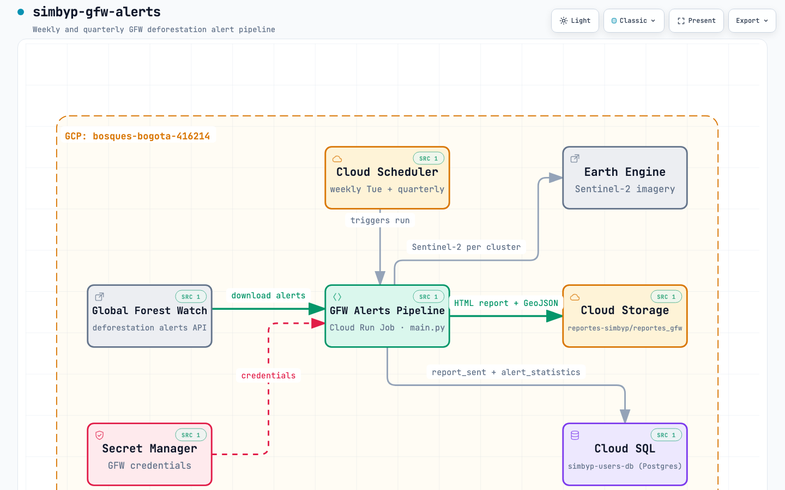

# Sistema Monitoreo de Bosques y Páramos de Bogotá (SIMBYP) - Alertas GFW

Este repositorio contiene herramientas para el análisis y monitoreo de alertas de deforestación en Bogotá, integrando la API de Global Forest Watch (GFW) para descargar y procesar alertas integradas de deforestación.

## Diagrama de Arquitectura



Diagrama interactivo (zoom, temas, exportación): [`docs/architecture.html`](docs/architecture.html) — generado con [Archify](https://github.com/tt-a1i/archify).

## Estructura del Repositorio

- `main.py`: Script principal para ejecutar el pipeline completo de alertas GFW.
  - Modo semanal: sin argumentos, genera reporte de la semana anterior
  - Modo trimestral: con `--trimestre` y `--anio`, genera reporte trimestral
- `src/`: Módulos del pipeline.
  - `download_gfw_data.py`: Descarga de datos desde GFW API.
  - `process_gfw_alerts.py`: Procesamiento y enriquecimiento de alertas.
  - `create_final_json.py`: Construcción del JSON consolidado para reportes.
  - `maps.py`: Generación de mapas interactivos.
- `reporte/`: Renderizado de reportes HTML.
  - `render_report.py`: Lógica de renderizado.
  - `report_template.html`: Plantilla HTML para reportes.
- `requirements.txt`: Dependencias Python.
- `.gitignore`: Archivos ignorados por Git.

Frecuencia recomendada: Semanal (automática) o Trimestral (manual).

## Dependencies

Instala las dependencias con `pip install -r requirements.txt`:

- python-dotenv
- requests
- geopandas
- pandas
- shapely
- matplotlib
- contextily
- ee
- geemap
- matplotlib-scalebar
- gcsfs
- google-cloud-storage
- scikit-learn
- tenacity

## Configuration

Crea un archivo `.env` en la raíz con variables de entorno requeridas (credenciales GFW, rutas GCS, etc.). Consulta 'MMC - General - SDP - Monitoreo de Bosques/monitoreo_bosques/dot_env_content.txt' para detalles.

## Usage

El script principal puede ejecutarse en dos modos:

### 1. Reporte Semanal (sin parámetros)

Para generar un reporte de las alertas de deforestación de la semana anterior:

```bash
python main.py
```

Este comando generará automáticamente un reporte con las alertas desde el lunes hasta el domingo de la semana anterior a la fecha actual.

### 2. Reporte Trimestral (con parámetros)

Ejecuta el script con trimestre (I, II, III, IV) y año (YYYY):

```bash
python main.py --trimestre I --anio 2024
```

**Ejemplos:**

```bash
# Reporte del primer trimestre de 2024
python main.py --trimestre I --anio 2024

# Reporte del cuarto trimestre de 2023
python main.py --trimestre IV --anio 2023

# Reporte semanal automático
python main.py
```

Ambos modos descargan alertas GFW, las procesan, generan mapas y reportes, y suben los resultados a Google Cloud Storage.

## Google Cloud Run

Esta aplicación está configurada para ejecutarse automáticamente en Google Cloud Platform como un Cloud Run Job programado.

### Arquitectura

- **Cloud Run Job**: Ejecuta el pipeline de alertas en un contenedor Docker
- **Cloud Scheduler**: Programa la ejecución automática cada lunes a las 8:00 AM (hora de Bogotá)
- **Secret Manager**: Almacena credenciales de forma segura (usuario GFW, contraseña, API keys, etc.)
- **Cloud Storage**: Almacena reportes generados en `gs://reportes-simbyp/reportes_gfw/`
- **Service Account**: `sa-bosques-app@bosques-bogota-416214.iam.gserviceaccount.com` con permisos para GCS y Secret Manager

### Deployment

#### Opción rápida (recomendada)

Usa el script de despliegue en un solo comando:

```bash
./scripts/deploy.sh
```

Este script:

- Construye la imagen con Cloud Build
- Crea o actualiza el Cloud Run Job
- Configura secretos (`GFW_USERNAME`, `GFW_PASSWORD`, `ALIAS`, `EMAIL`, `ORG`, `DATABASE_URL`)
- Configura variables de entorno (`OUTPUTS_BASE_PATH`, `INPUTS_PATH`, `GCP_PROJECT`)
- Crea o actualiza el Cloud Scheduler

Overrides comunes:

```bash
# Cambiar nombre del job o cron
JOB_NAME=gfw-weekly-alerts-staging \
SCHEDULER_JOB_NAME=gfw-weekly-alerts-trigger-staging \
SCHEDULE="0 7 * * 1" \
./scripts/deploy.sh

# Cambiar proyecto/región
PROJECT_ID=mi-proyecto \
REGION=us-east1 \
./scripts/deploy.sh
```

#### Prerequisitos

- Acceso al proyecto GCP: `bosques-bogota-416214`
- gcloud CLI instalado y autenticado
- Service account con permisos adecuados
- Credenciales GFW (usuario, contraseña, alias, email, organización)

#### Paso 1: Habilitar APIs Requeridas

```bash
gcloud config set project bosques-bogota-416214
gcloud services enable secretmanager.googleapis.com
gcloud services enable run.googleapis.com
gcloud services enable cloudbuild.googleapis.com
gcloud services enable cloudscheduler.googleapis.com
```

#### Paso 2: Crear Secrets en Secret Manager

```bash
echo -n 'YOUR_GFW_USERNAME' | gcloud secrets create GFW_USERNAME --data-file=-
echo -n 'YOUR_GFW_PASSWORD' | gcloud secrets create GFW_PASSWORD --data-file=-
echo -n 'YOUR_API_ALIAS' | gcloud secrets create ALIAS --data-file=-
echo -n 'YOUR_EMAIL' | gcloud secrets create EMAIL --data-file=-
echo -n 'YOUR_ORG' | gcloud secrets create ORG --data-file=-
```

**Nota**: Reemplaza `YOUR_*` con los valores reales de las credenciales GFW. Estas credenciales se almacenan de forma segura y encriptada en Secret Manager.

#### Paso 3: Otorgar Acceso a Service Account

```bash
for secret in GFW_USERNAME GFW_PASSWORD ALIAS EMAIL ORG; do
  gcloud secrets add-iam-policy-binding $secret \
    --member serviceAccount:sa-bosques-app@bosques-bogota-416214.iam.gserviceaccount.com \
    --role roles/secretmanager.secretAccessor
done
```

#### Paso 4: Construir y Desplegar Container

```bash
# Construir imagen Docker
gcloud builds submit --tag gcr.io/bosques-bogota-416214/gfw-weekly-alerts

# (Opcional: solo para actualizaciones) Actualizar la imagen del container
gcloud run jobs update gfw-weekly-alerts --image gcr.io/bosques-bogota-416214/gfw-weekly-alerts

# Crear Cloud Run Job
gcloud run jobs create gfw-weekly-alerts \
  --image gcr.io/bosques-bogota-416214/gfw-weekly-alerts \
  --region us-central1 \
  --memory 2Gi \
  --cpu 1 \
  --max-retries 2 \
  --task-timeout 30m \
  --service-account sa-bosques-app@bosques-bogota-416214.iam.gserviceaccount.com \
  --set-secrets GFW_USERNAME=GFW_USERNAME:latest,GFW_PASSWORD=GFW_PASSWORD:latest,ALIAS=ALIAS:latest,EMAIL=EMAIL:latest,ORG=ORG:latest \
  --set-env-vars OUTPUTS_BASE_PATH=gs://reportes-simbyp,GCP_PROJECT=bosques-bogota-416214,INPUTS_PATH=gs://material-estatico-sdp/SIMBYP_DATA
```

#### Paso 5: Configurar Permisos de Invocación

```bash
gcloud run jobs add-iam-policy-binding gfw-weekly-alerts \
  --region us-central1 \
  --member serviceAccount:sa-bosques-app@bosques-bogota-416214.iam.gserviceaccount.com \
  --role roles/run.invoker
```

#### Paso 6: Crear Programación Automática

```bash
# Ejecuta cada lunes a las 8:00 AM (hora de Bogotá)
gcloud scheduler jobs create http gfw-weekly-alerts-trigger \
  --location us-central1 \
  --schedule "0 8 * * 1" \
  --time-zone "America/Bogota" \
  --uri "https://us-central1-run.googleapis.com/apis/run.googleapis.com/v1/namespaces/bosques-bogota-416214/jobs/gfw-weekly-alerts:run" \
  --http-method POST \
  --oauth-service-account-email sa-bosques-app@bosques-bogota-416214.iam.gserviceaccount.com
```

### Monitoreo y Pruebas

#### Ejecutar Manualmente

```bash
gcloud run jobs execute gfw-weekly-alerts --region us-central1
```

#### Ver Logs

```bash
gcloud logging read "resource.type=cloud_run_job AND resource.labels.job_name=gfw-weekly-alerts" --limit 50 --format=json
```

#### Verificar Reportes Generados

```bash
gsutil ls gs://reportes-simbyp/reportes_gfw/
```

### Actualizar el Job

Si realizas cambios en el código:

```bash
# 1. Reconstruir imagen
gcloud builds submit --tag gcr.io/bosques-bogota-416214/gfw-weekly-alerts

# 2. Actualizar el job
gcloud run jobs update gfw-weekly-alerts \
  --image gcr.io/bosques-bogota-416214/gfw-weekly-alerts \
  --region us-central1
```

### Programación

- **Frecuencia**: Cada lunes a las 8:00 AM (hora de Bogotá)
- **Formato Cron**: `0 8 * * 1`
- **Zona horaria**: `America/Bogota` (UTC-5)

### Costos

Cloud Run Jobs solo cobra por tiempo de ejecución:

- Aproximadamente 5 a 15 minutos por ejecución semanal
- Costos estimados: < $5 USD/mes

### Seguridad

- **Credenciales**: Nunca incluyas credenciales en el código o el repositorio
- **Secret Manager**: Todas las credenciales se almacenan encriptadas en Google Secret Manager
- **Service Account**: El acceso a recursos GCP se controla mediante service account con permisos mínimos necesarios
- **.env local**: Solo para desarrollo local, nunca debe ser committed a Git

## Colaboradores

Mantenido por el equipo de Métodos Mixtos (Daniel Wiesner, Javier Guerra, Samuel Blanco, Laura Tamayo). Para sugerencias, crea un Issue o Pull Request.

## Set-up

- `python3 -m venv .venv`
- `source .venv/bin/activate`
- `pip install --upgrade pip setuptools wheel`
- `pip install -r requirements.txt`
- Crea el archivo `.env` con las variables requeridas.

## Licencia

Licencia pública. Código propiedad de la Secretaría Distrital de Planeación de Bogotá.
